# ROSMI — Registro do desenvolvimento

Registro organizado de tudo o que foi feito no trabalho, na ordem das
atividades do enunciado, com os comandos, as saídas e os prints de cada etapa.
Serve de base para escrever o relatório final. Os tópicos ainda sem conteúdo
são atividades que ainda não foram feitas.

Todos os comandos rodam a partir da **raiz do repositório** (`rosmi_c/`).

---

## 1. Introdução

Este trabalho faz parte da disciplina de Modelagem de Sistemas Embarcados
(*Sistemas Multiprocessados em Chip — Comunicação e Computação*). A disciplina
trata de **modelos de computação** (MoCs, do inglês *Models of Computation*):
abstrações que capturam as
informações essenciais de um sistema para que se possa raciocinar sobre ele
antes de implementá-lo. O foco é a comunicação e a computação de aplicações
paralelas executando em sistemas multiprocessados em chip, interligados por uma
rede intrachip (NoC, *Network-on-Chip*): uma malha de roteadores em que cada
roteador liga um **tile**, a posição onde fica um núcleo de processamento ou de
memória.

O objetivo é modelar, explorar e caracterizar uma aplicação paralela, o ROSMI
(Reconhecedor de Objetos por Segmentação em Múltiplas Imagens), e usar o
framework **CAFES** (*Communication Analysis For Embedded Systems*) para mapear os seus núcleos nos tiles de uma NoC,
estimando tempo de execução e consumo de energia.

O trabalho segue a metodologia apresentada na disciplina no estudo de caso do
Mandelbrot:

```
Aplicação + Arquitetura alvo  →  Descrição (versão paralela)
Descrição  →  Simulação / Extração  →  Dados  →  modelos CWM, ACPM e CDCM  →  CAFES
```

O CAFES trabalha com modelos da aplicação. Três deles são usados neste
trabalho:

- **CWM** (*Communication Weight Model*, modelo de comunicação com pesos):
  quanto cada núcleo envia a cada outro;
- **ACPM** (*Application Communication Pattern Model*, modelo do padrão de
  comunicação da aplicação): as mesmas mensagens, em ordem no tempo;
- **CDCM** (*Communication Dependence and Computation Model*, modelo de
  dependência da comunicação e computação): as dependências entre as mensagens
  e o tempo de computação de cada núcleo.

As etapas são:

1. entender a aplicação;
2. implementar uma versão sequencial;
3. paralelizar a aplicação, com uma visão parcial da arquitetura alvo;
4. obter os dados da versão paralela e construir os modelos da aplicação;
5. usar os modelos no CAFES para avaliar mapeamentos, tempo e energia.

---

## 2. Problema proposto

> Este trabalho consiste da modelagem, exploração e caracterização de uma
> aplicação paralela, cujo objetivo é reconhecer objetos por segmentação de
> imagens dispostas em uma matriz de N × M segmentos, sendo cada segmento
> composto por K × L pixels. Denominaremos esta aplicação de ROSMI
> (Reconhecedor de Objetos por Segmentação em Múltiplas Imagens).
>
> "Dada uma matriz de N × M de segmentos de imagens binárias, com pixels de um
> valor que representam o fundo (e.g. valor 0) e com pixels de outro valor que
> representam os objetos (e.g. valor 1), onde um objeto é um conjunto de pixels
> contíguos, o algoritmo de reconhecimento de imagem deve contabilizar todos os
> objetos identificados uma única vez". Deseja-se que a solução proposta
> permita resolver o problema de forma sequencial e paralela.
>
> — enunciado ([`docs/ROSMI_V11.pdf`](../docs/ROSMI_V11.pdf))

A figura do enunciado mostra uma imagem de **N = 2 × M = 3 segmentos**, cada um
com **K = 768 × L = 1024 pixels**, com **13 objetos**. Um deles, o hexágono, é
distribuído em quatro segmentos e só pode ser contado uma vez.

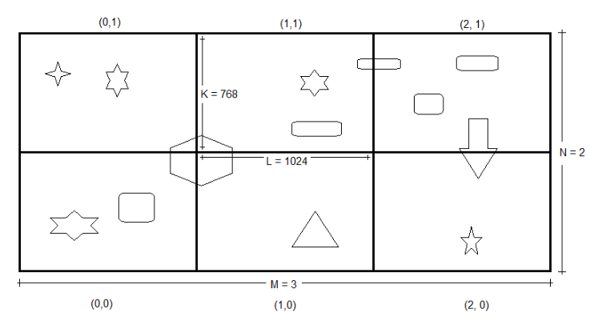

O grupo deve usar o CAFES para determinar o mapeamento dos núcleos nos tiles de
uma NoC 2D ou 3D. Para o consumo de energia e o tempo de computação, podem ser
usados valores sintéticos, desde que a caracterização seja verossímil.

**Atividades pedidas:**

1. Entender a aplicação proposta.
2. Fazer uma versão sequencial da aplicação. Apresentar o algoritmo e a técnica
   de reconhecimento de imagem usada. Executar e verificar a solução no exemplo
   fornecido.
3. Fazer uma versão paralela da aplicação em C ou Java.
4. Usar o CAFES para explorar a aplicação com os modelos **CWM** e **ACPM**
   (e, eventualmente, **CDCM**), explorando os tempos de computação estimados,
   o mapeamento e o consumo de energia de cada modelo.
5. Explorar soluções com diferentes números de processadores, comparando
   desempenho e consumo de energia, em **3 segmentações** de imagem (a do
   exemplo e mais duas, e.g. 8 × 6 e 7 × 7), com arquiteturas alvo de número de
   tiles próximo, mas igual ou superior, ao de núcleos.

**Entrega:** um relatório, de formato livre, com a descrição da aplicação e as
explorações acima.

---

## 3. Desenvolvimento

### 3.1 Ambiente e ferramentas

Tudo o que é necessário está no repositório: o ROSMI (em C), o gerador dos
modelos (`tools/gen_cafes.py`) e o CAFES (`third_party/cafes/`).

```bash
sudo apt install build-essential libpng-dev default-jre
```

- `build-essential`: `gcc` e `make`, para compilar o ROSMI;
- `libpng-dev`: para o ROSMI ler a imagem PNG (*Portable Network Graphics*, o
  formato da imagem fornecida pelo professor);
- `default-jre`: Java, para o CAFES;
- Python 3, que já vem no Ubuntu, para gerar os modelos do CAFES.

Compilação:

```bash
make
```

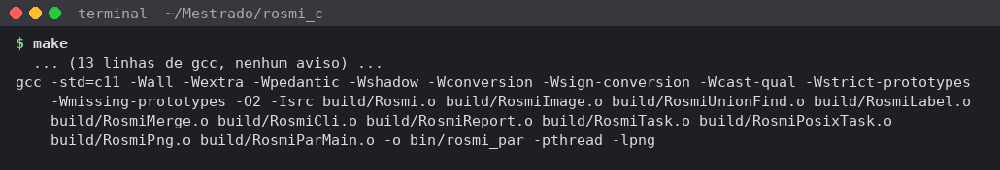

São gerados `bin/rosmi_seq` (versão sequencial) e `bin/rosmi_par` (versão
paralela). A compilação não emite nenhum aviso.

---

### 3.2 Atividade 1 — Entendimento da aplicação

#### 3.2.1 A imagem de entrada

A entrada é a imagem fornecida pelo professor,
[`imagem_trabalho.png`](imagem_trabalho.png), com 3072 × 1536 pixels. O ROSMI lê
o PNG diretamente: um pixel escuro (cinza abaixo de 128) é objeto, e um pixel
claro é fundo.

Com a divisão em 2 × 3 segmentos, a imagem fica assim. Em laranja, os 3 objetos
que atravessam a fronteira entre segmentos:

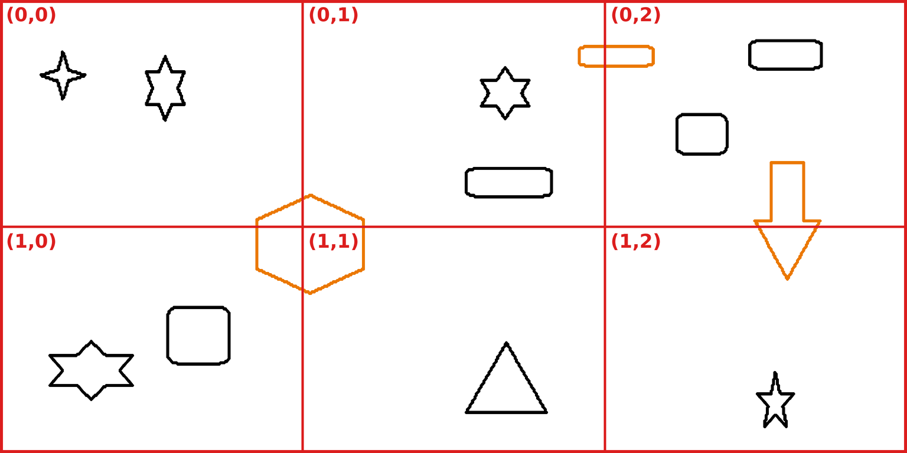

| Objeto distribuído | Segmentos que ele toca |
|---|---|
| hexágono | (0,0), (0,1), (1,0), (1,1) |
| retângulo pequeno do alto | (0,1), (0,2) |
| seta | (0,2), (1,2) |

> Os segmentos aqui são numerados como **(linha, coluna)**, a partir do canto
> superior esquerdo. A figura do enunciado usa outra convenção (coluna, linha),
> contando de baixo para cima.

O enunciado cita só o hexágono, mas a imagem tem **3 objetos distribuídos**.
Somar o que cada segmento vê sozinho dá **18**, e não 13: o hexágono é contado
4 vezes, e o retângulo e a seta 2 vezes cada. A dificuldade do problema está
nessa reconciliação entre segmentos.

#### 3.2.2 A imagem exige conectividade 8

Os contornos da imagem têm a espessura de um traço fino, e nas diagonais os
pixels **só se tocam pela quina**. Ampliando um trecho de diagonal (cada cor é
um objeto diferente para a conectividade 4):

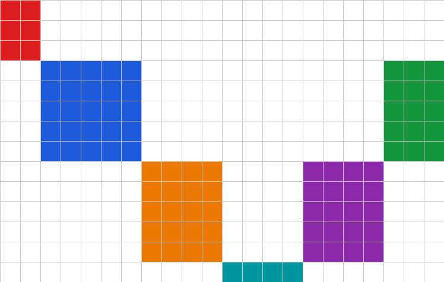

- Com **conectividade 4**, que só liga vizinhos de lado, cada degrau vira um
  objeto separado: **473 objetos**.
- Com **conectividade 8**, que também liga vizinhos de quina, cada contorno é
  um objeto só: **13 objetos**, a resposta do enunciado.

Por isso todas as execuções a seguir usam `--conn 8`.

---

### 3.3 Atividade 2 — Versão sequencial

#### 3.3.1 Algoritmo e técnica de reconhecimento

A técnica é a **rotulação de componentes conexos** (*connected component
labeling*). A imagem é percorrida linha a linha; cada pixel de objeto recebe um
rótulo, herdado dos vizinhos já visitados. Quando dois vizinhos têm rótulos
diferentes, os dois rótulos são do mesmo objeto, e essa equivalência é anotada
numa estrutura **union-find**. No fim, o número de objetos é o número de
grupos distintos no union-find.

A rotulação guarda só a linha anterior e a linha corrente, não a imagem de
rótulos inteira. A explicação completa, com exemplos, está em
[`docs/background.md`](../docs/background.md), seções 2.1 e 2.2.

#### 3.3.2 Execução no exemplo fornecido

```bash
bin/rosmi_seq reports/imagem_trabalho.png --N 2 --M 3 --conn 8
```

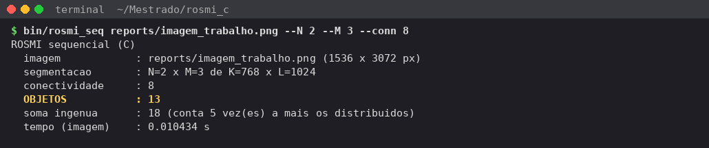

- **OBJETOS: 13**, a resposta do enunciado.
- **Soma ingênua: 18**, o que daria somar cada segmento sozinho.

---

### 3.4 Atividade 3 — Versão paralela

#### 3.4.1 Algoritmo paralelo

A versão paralela usa o mesmo núcleo de rotulação, chamado uma vez por
segmento, em três fases:

1. **Local:** cada segmento conta os seus objetos e guarda os rótulos das suas
   quatro bordas. Os segmentos são independentes e rodam em paralelo.
2. **Bordas:** segmentos vizinhos comparam as bordas que se encostam e unem, no
   union-find, os pedaços do mesmo objeto. Só os vetores de borda trafegam,
   nunca os pixels.
3. **Redução:** conta os grupos que sobraram.

Detalhes em [`docs/background.md`](../docs/background.md), seções 2.3 e 2.4.

#### 3.4.2 Execução no exemplo fornecido

```bash
bin/rosmi_par reports/imagem_trabalho.png --N 2 --M 3 --conn 8 --threads 4
```

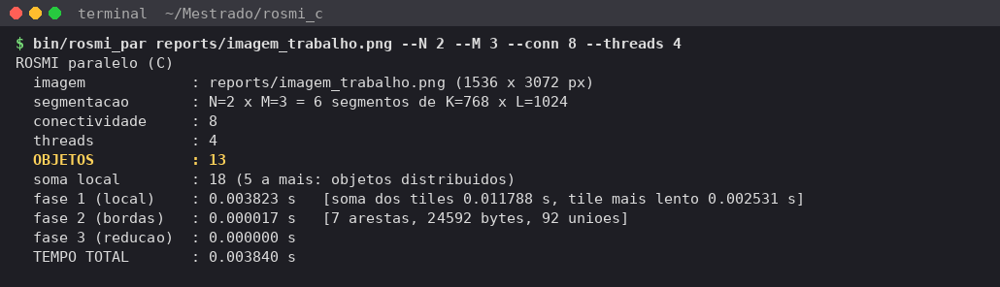

- **Fase 1:** soma local = 18.
- **Fase 2:** 7 fronteiras, 4 entre vizinhos da mesma linha e 3 entre vizinhos
  da mesma coluna. Com conectividade 8, os cantos onde 4 segmentos se encontram
  também são comparados; por isso trafegam 16 bytes a mais do que com
  conectividade 4.
- **Fase 3:** **13 objetos**.

Para comparar, a mesma imagem com conectividade 4:

```bash
bin/rosmi_par reports/imagem_trabalho.png --N 2 --M 3 --conn 4 --threads 4
```

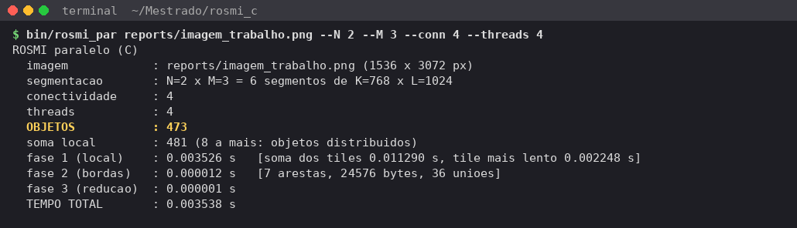

#### 3.4.3 A contagem não depende do número de threads

```bash
for p in 1 2 4 8; do
  bin/rosmi_par reports/imagem_trabalho.png --N 2 --M 3 --conn 8 --threads $p | grep OBJETOS
done
```

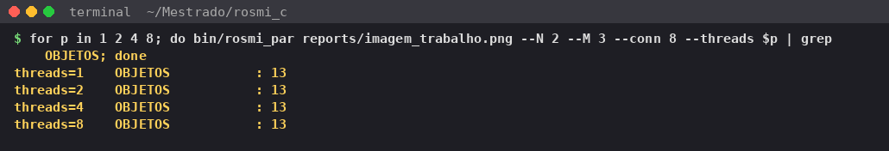

#### 3.4.4 Papel de cada versão

O enunciado pede as duas versões porque cada uma tem um papel na metodologia:

1. **A sequencial é a base da paralela.** O enunciado pede que a aplicação
   sequencial seja "utilizada como base para elaborar um algoritmo paralelo
   parametrizável". A versão paralela reaproveita exatamente o núcleo da
   sequencial (`RosmiLabel`): a sequencial chama a rotulação uma vez, na imagem
   inteira; a paralela chama uma vez por segmento.
2. **A sequencial é a referência de correção.** Ela não tem concorrência, e por
   isso é fácil confirmar que dá a resposta certa (13 objetos, seção 3.3.2). A
   paralela é validada comparando com ela: dá os mesmos 13 objetos, com
   qualquer número de threads (seção 3.4.3).
3. **A paralela é a descrição que alimenta os modelos.** Na metodologia
   (Aplicação + Arquitetura alvo → Descrição → Dados → modelos), a descrição é
   a versão paralela, escrita para a arquitetura alvo: um processador por
   segmento, ligados por uma NoC (rede intrachip). Só nela existem núcleos que trocam
   mensagens, que é o que os modelos do CAFES capturam (seção 3.5).
4. **A sequencial é a referência de desempenho.** Ela é o caso de um processador
   só, contra o qual se mede o ganho do paralelismo.

Para a comparação de desempenho, a versão sequencial foi medida do mesmo jeito
que o traço da paralela (melhor de 8 execuções, na mesma sessão):

```bash
bin/rosmi_seq reports/imagem_trabalho.png --N 2 --M 3 --conn 8 --reps 8
```

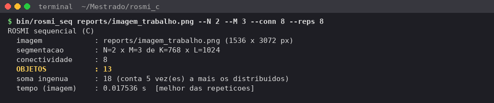

Com a mesma calibração da seção 3.5.2, os 17,5 ms medidos equivalem a 36,8
milhões de ciclos, ou **368 ms num único tile de 100 MHz**. Comparação com a
versão paralela, cujos tempos vêm do modelo CDCM (seção 3.6):

| Versão | Processadores | Tempo num tile de 100 MHz | Ganho |
|---|---|---|---|
| sequencial | 1 | 368 ms | — |
| paralela 2 × 3 | 6 | 54,5 ms | 6,8× |
| paralela 4 × 6 | 24 | 21,2 ms | 17× |
| paralela 8 × 6 | 48 | 10,4 ms | 35× |

O tempo da sequencial é só computação; o da paralela inclui também a
comunicação pela NoC. No 2 × 3, o ganho é maior que o número de processadores
porque a sequencial gasta mais ciclos por pixel (7,8 contra 5,6 nos segmentos):
rotular a imagem inteira de uma vez trabalha com linhas três vezes mais longas e
um union-find maior.

---

### 3.5 Atividade 4 — Exploração no CAFES

#### 3.5.1 Arquitetura alvo e modelo da aplicação

A aplicação é modelada com três tipos de núcleo, um por tile de uma **NoC malha
2D** (rede intrachip em forma de malha) com roteamento XY (o pacote anda primeiro na direção X, ao longo da linha,
e depois na direção Y, ao longo da coluna). Os nomes seguem o exemplo SegImag
(segmentação de imagens) que acompanha o CAFES, que usa as mesmas siglas sem
defini-las; aqui cada uma tem este papel:

- `ME`: a **memória** que guarda a imagem e envia cada segmento ao seu PA;
- `PA0` a `PA5`: os **processadores**, um por segmento, que fazem a rotulação
  local e trocam bordas com os vizinhos;
- `PC`: o **processador coletor**, que faz a união final e produz a contagem.

No exemplo 2 × 3 são **8 núcleos** numa NoC de **2 × 4 tiles**. A comunicação
acontece em fases:

| Fase | Comunicação | Volume |
|---|---|---|
| 0 | `ME → PAs` | carga do segmento: K·L bits |
| 1 | `PA → PA` (mesma linha) | borda vertical: K rótulos de 32 bits |
| 2 | `PA → PA` (mesma coluna) | borda horizontal: L rótulos de 32 bits |
| 3 | `PAs → PC` | contagem local e pares de equivalência |
| 4 | `PC → PAs` | resultado global |

#### 3.5.2 Obtenção dos dados para modelagem

**Tempo de computação de cada segmento**, medido com 1 thread, para que um
tile não dispute processador com outro, e com a melhor de 8 repetições:

```bash
bin/rosmi_par reports/imagem_trabalho.png --N 2 --M 3 --conn 8 \
    --threads 1 --reps 8 --trace reports/saidas/trabalho_p1
```

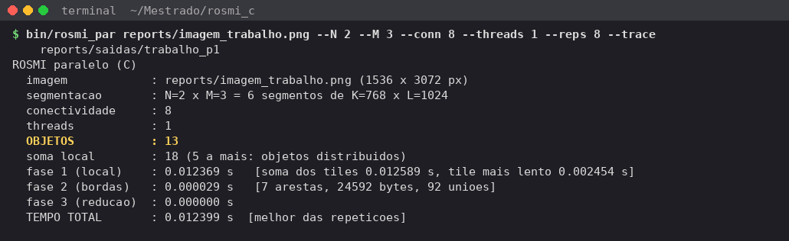

São gravados `saidas/trabalho_p1_tiles.csv` (tempo e componentes por segmento)
e `saidas/trabalho_p1_edges.csv` (uniões por fronteira).

**Computação de cada segmento, em ciclos.** O tempo medido vale para o
computador onde foi medido, um Intel i3-10110U de 2,1 GHz (frequência máxima
informada pelo `lscpu`). Multiplicado por essa frequência, ele dá os **ciclos**
que a rotulação gastou: no 2 × 3, cerca de 4,4 milhões por segmento, ou 5,6
ciclos por pixel. O tile da NoC (rede intrachip) executa esses mesmos ciclos na sua própria
frequência, de 100 MHz, o que dá cerca de 44 ms por segmento.

A frequência do computador de medição varia com a carga e a temperatura, e o
tempo medido varia junto. Por isso todos os tempos usados na comparação (a
versão sequencial e os traços das três segmentações) foram medidos **na mesma
sessão, em sequência**.

**Geração dos modelos.** O `gen_cafes.py` calcula o volume de cada mensagem a
partir da segmentação (lida de [`imagem_trabalho.json`](imagem_trabalho.json)),
converte os tempos medidos em ciclos e gera os três arquivos de entrada do
CAFES:

```bash
python3 tools/gen_cafes.py --case reports/imagem_trabalho --out reports/cafes \
    --trace reports/saidas/trabalho_p1_tiles.csv --host-mhz 2100
python3 tools/check_cafes.py reports/cafes/imagem_trabalho
```

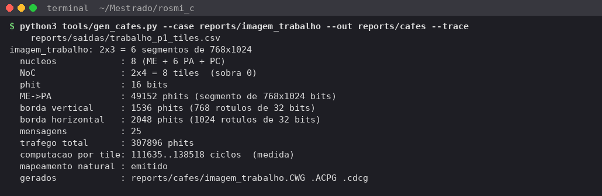

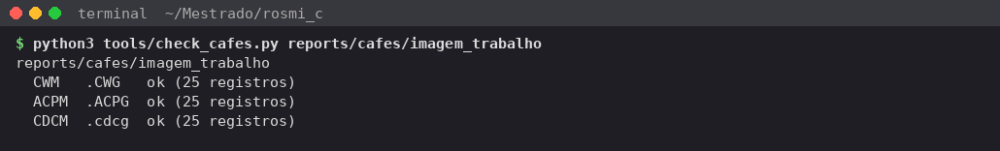

| Arquivo | Modelo | Conteúdo |
|---|---|---|
| `cafes/imagem_trabalho.CWG` | CWM | CWG (*Communication Weight Graph*): grafo de comunicação com pesos |
| `cafes/imagem_trabalho.ACPG` | ACPM | ACPG (*Application Communication Pattern Graph*): mensagens agrupadas por instante |
| `cafes/imagem_trabalho.cdcg` | CDCM | CDCG (*Communication Dependence and Computation Graph*): mensagens, dependências e computação |

Nesta geração, o volume é convertido de bits para phits (*physical units*: os
bits que um link da NoC transfere por ciclo) de 16 bits, e o ACPM (modelo do padrão de comunicação) agrupa as
mensagens nas 5 fases da tabela da seção 3.5.1.

#### 3.5.3 Decisões de modelagem

| Decisão | Escolha | Justificativa |
|---|---|---|
| Unidade de volume | phit de 16 bits | Largura de link usada nos exemplos do CAFES. O estudo de caso do Mandelbrot usa a contagem de bits direto; a escala da energia muda, mas a comparação entre mapeamentos e segmentações não. |
| Ordem das mensagens no ACPM | 5 fases (carga, borda vertical, borda horizontal, envio ao PC, resultado) | Pela definição do ACPM, cada Tᵢ = (tᵢ, mᵢ) é um **conjunto** de mensagens; as mensagens de uma fase acontecem ao mesmo tempo. O Mandelbrot usa uma mensagem por tag, ordenada pelo instante em que ocorreu. |
| Obtenção dos dados | volumes calculados a partir do algoritmo; computação medida na execução | Corresponde aos dois caminhos da metodologia: **extração** (volumes) e **simulação/execução** (tempos). |
| Computação no tile | ciclos medidos no computador de medição (tempo × 2,1 GHz), executados a 100 MHz | Converter o tempo medido direto pela frequência da NoC suporia um tile tão rápido quanto o computador de medição. Os ciclos medidos preservam o custo real da rotulação e a diferença entre segmentos. |
| Dependências no CDCM | cada mensagem depende só do que o seu núcleo precisa: a primeira mensagem de um PA, da carga do seu segmento; o envio ao PC, das bordas recebidas; o resultado do PC, de todos os envios ao PC | Assim os PAs computam em paralelo logo que recebem o seu segmento, como na versão paralela. |
| Arquitetura alvo | bloco de PAs na mesma disposição dos segmentos, mais uma coluna para ME e PC | Vizinhos na imagem são vizinhos na NoC: a troca de bordas custa um salto. Os tiles que sobram ficam vazios (`VZ0`, `VZ1`, …). |
| Algoritmo de mapeamento | busca exaustiva no 2 × 3; Simulated Annealing (SA) nos demais | O mapeamento é um problema NP-completo (não se conhece algoritmo exato rápido), com O(n!) mapeamentos possíveis. Com 8 núcleos são 40 320 mapeamentos; com 26 ou 50, a busca exaustiva é inviável. |

O Simulated Annealing e a Busca Tabu são as duas
heurísticas de busca do CAFES. Elas são **aleatórias**: cada execução
pode dar um resultado diferente. Os números a seguir são de uma execução de
cada.

#### 3.5.4 Parâmetros da NoC usados no CAFES

Foram usados os parâmetros padrão do CAFES, iguais em todas as execuções:

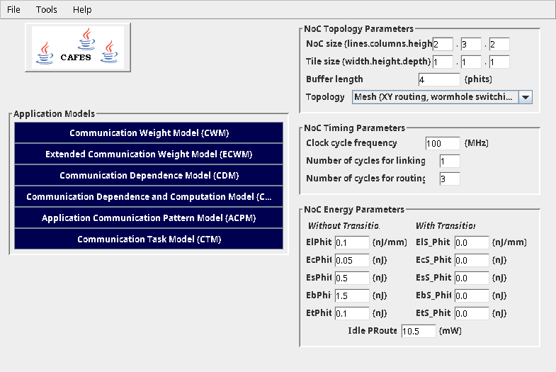

| Parâmetro | Valor |
|---|---|
| Topologia | malha 2D, roteamento XY, chaveamento *wormhole* (o pacote avança pela rede ocupando vários roteadores ao mesmo tempo) |
| Frequência | 100 MHz |
| Ciclos por link / por roteamento | 1 / 3 |
| Buffer | 4 phits |
| Energia por phit: link (El), conexão local (Ec), chave (Es), buffer (Eb) | 0,1 nJ/mm; 0,05 nJ; 0,5 nJ; 1,5 nJ |
| Potência do roteador sem tráfego (P_Router) | 10,5 mW |

O tamanho da NoC (rede intrachip) vem de cada arquivo de modelo.

#### 3.5.5 Modelo CWM

##### 3.5.5.1 Busca exaustiva

**Abrir o CAFES:**

```bash
tools/cafes.sh
```

**Abrir o modelo CWM:** clique em **Communication Weight Model (CWM)**.

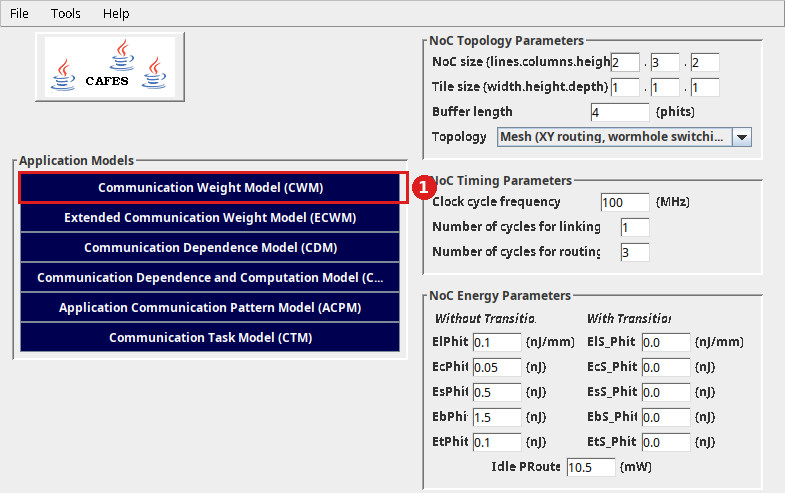

**Carregar o grafo:** na janela **CWM Mapping**, clique em **File → Load
graph**.

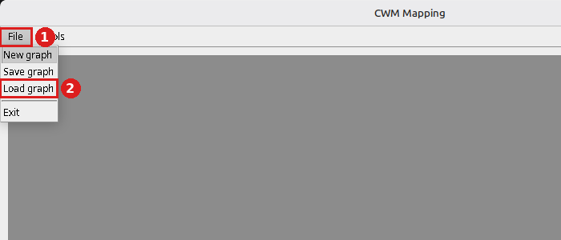

Na janela de escolha de arquivo, aperte **Ctrl+L**, digite o caminho do `.CWG`
e clique em **Open**:

```
<caminho do repositório>/reports/cafes/imagem_trabalho.CWG
```


**Conferir o grafo:**

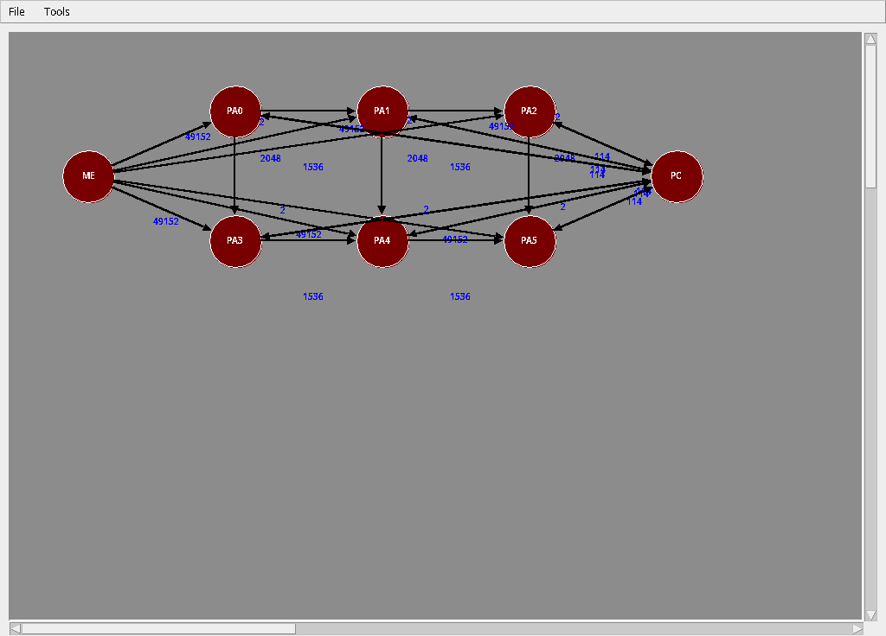

Os números nas setas são os phits (unidade de transferência do link) trocados entre os núcleos: 49 152 na carga de
cada segmento (`ME → PA`), 1 536 e 2 048 nas bordas (`PA → PA`), 114 no envio
ao coletor (`PA → PC`) e 2 no resultado (`PC → PA`).

Na janela principal, o **NoC size** muda sozinho para **2 · 4 · 1**, lido do
arquivo:

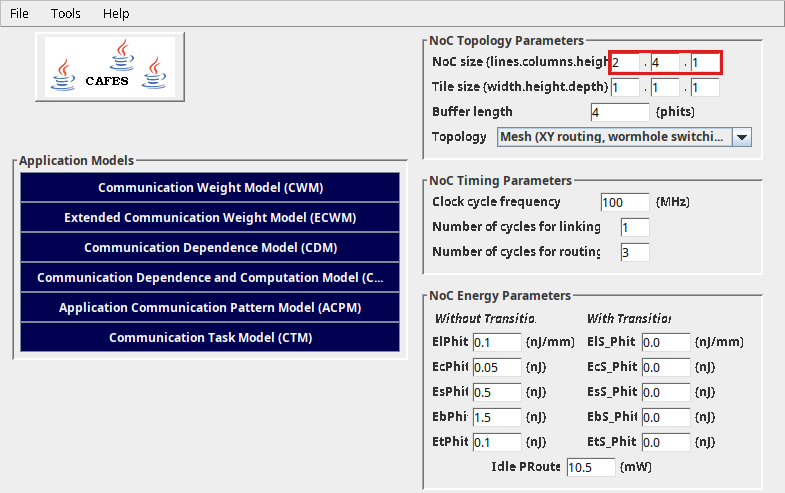

**Rodar o mapeamento:** na janela **CWM Mapping**, clique em **Tools →
Exhaustive Search Mapping Algorithm**.

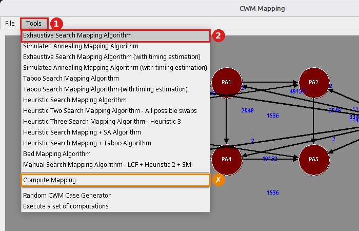

> **Não use "Compute Mapping" (em laranja) no CWM.** Um bug do CAFES na leitura
> do `.CWG` faz essa opção travar em "Computing..." numa NoC 2D (detalhes em
> [`third_party/cafes/README.md`](../third_party/cafes/README.md)). Os
> algoritmos de busca não são afetados.

Com 8 núcleos, a busca exaustiva termina em poucos segundos.

**Resultado:**

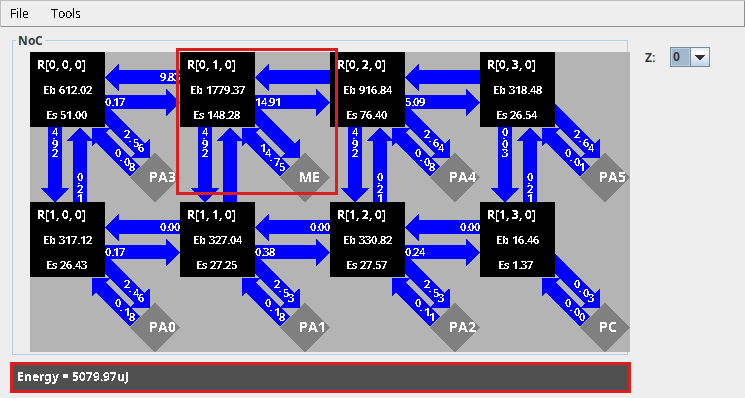

- **Energy = 5079,97 µJ**: a energia do melhor mapeamento possível, porque a
  busca exaustiva testa todas as combinações.
- Cada quadrado preto é um roteador `R[linha, coluna, camada]`, e o losango
  cinza ao lado é o núcleo mapeado nele.
- O **ME** (memória) ficou no centro da malha, em `R[0,1]`. A carga `ME → PAs` é quase
  96% do tráfego, então o melhor lugar para a memória é onde ela fica mais
  perto de todos os PAs (processadores de segmento).

O CWM só enxerga a quantidade de comunicação, que depende da segmentação
(2 × 3 de 768 × 1024) e não do desenho da imagem.

Como a busca exaustiva avalia os 40 320 mapeamentos, o CAFES informa também o
pior e a média ([log](saidas/cafes_logs/cwm_exaustivo.log)):

| Mapeamento | Energia |
|---|---|
| melhor (ótimo) | **5079,97 µJ** |
| média de todos | 6096,34 µJ |
| pior | 7112,71 µJ |

Um mapeamento ruim gasta **40% mais energia** que o ótimo. A busca levou 12 s
de processamento (CPU).

##### 3.5.5.2 Simulated Annealing

**Tools → Simulated Annealing Mapping Algorithm**: **5079,97 µJ**, o mesmo valor
do ótimo, com outro mapeamento equivalente (o ME de novo no centro), em 0,09 s.


##### 3.5.5.3 Busca Tabu

**Tools → Taboo Search Mapping Algorithm**: **5079,97 µJ** nesta execução.
Numa execução anterior, a Busca Tabu parou em 6059,17 µJ, 19% acima do ótimo,
com o ME num canto da malha. É o efeito de o algoritmo ser aleatório.

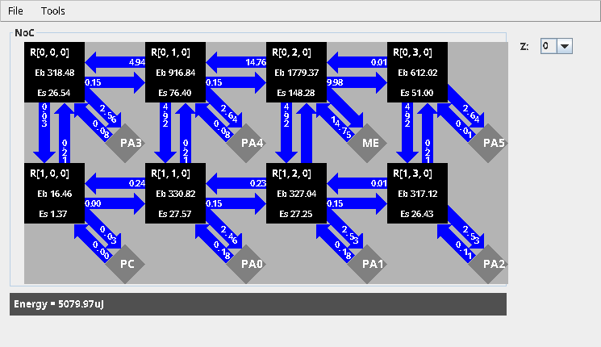

##### 3.5.5.4 Estimativa de tempo

O CWM não estima tempo: ele só captura a **quantidade** de comunicação, e não a
ordem das mensagens (aula 5, "Deficiências do CWM"). O tempo é obtido pelos
modelos ACPM (modelo do padrão de comunicação) e CDCM (modelo de dependência e computação), a seguir.

#### 3.5.6 Modelo ACPM

O ACPM carrega o `.ACPG` pelo botão **Application Communication Pattern Model
(ACPM)**, do mesmo jeito que o CWM (modelo de comunicação com pesos). Cada tag (0 a 4) é uma fase, com as suas
mensagens em linha:

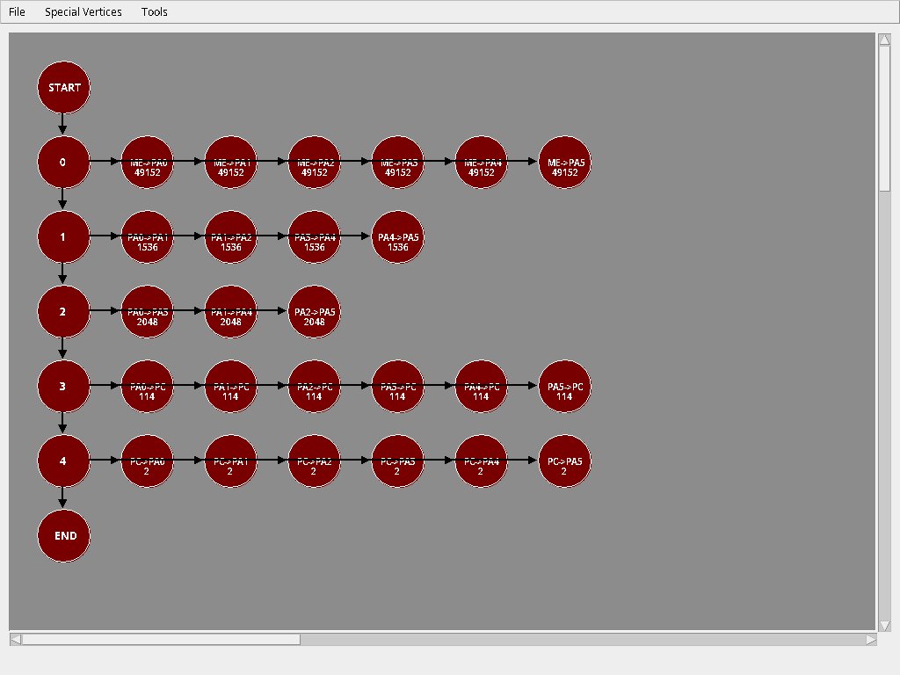

##### 3.5.6.1 Mapeamento

Além dos algoritmos de busca, o ACPM aceita o **Compute Mapping**, que avalia o
mapeamento escrito no arquivo: o **natural**, com cada PA (processador de segmento) no tile do seu
segmento e o ME (memória) e o PC (processador coletor) na última coluna.

| Mapeamento | Energia dinâmica | Energia ociosa | Tempo |
|---|---|---|---|
| natural | 6990,75 µJ | 251,38 µJ | 299 263 ciclos |
| busca exaustiva | **5079,97 µJ** | 251,37 µJ | 299 267 ciclos |
| Simulated Annealing | 5080,07 µJ | 251,38 µJ | 299 267 ciclos |
| Busca Tabu | 5109,48 µJ | 251,37 µJ | 299 267 ciclos |

Mapeamento natural e mapeamento ótimo (busca exaustiva):

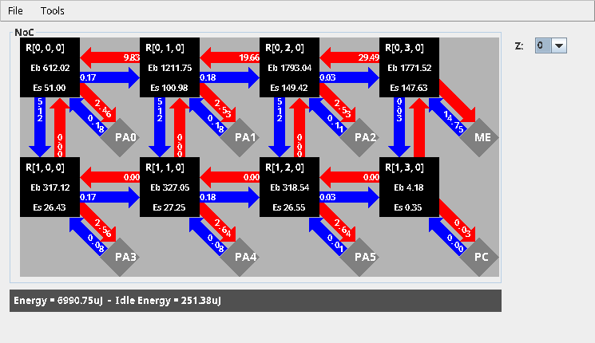

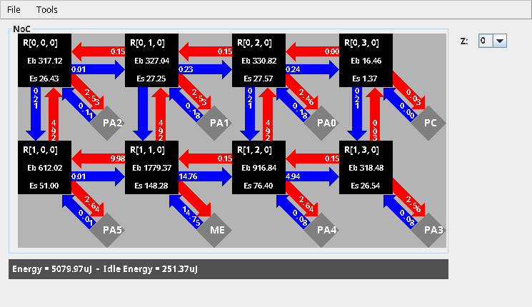

O mapeamento natural gasta 38% mais energia que o ótimo, porque deixa o ME num
canto: a carga dos segmentos atravessa a malha inteira.

##### 3.5.6.2 Tempo de execução

Na janela de resultado, **Tools → Execution Time** grava a tabela de tempo de
cada mensagem. Resumo da tabela do mapeamento natural
([`saidas/acpm_natural.timing`](saidas/acpm_natural.timing)):

| Fase | Mensagens | Ciclos |
|---|---|---|
| 0 — carga | `ME → PAs` | 1 a 294 927 |
| 1 — borda vertical | `PA → PA` | 294 928 a 296 473 |
| 2 — borda horizontal | `PA → PA` | 296 474 a 298 531 |
| 3 — envio ao PC | `PAs → PC` | 298 532 a 299 235 |
| 4 — resultado | `PC → PAs` | 299 236 a 299 263 |

**Tempo total: 299 263 ciclos, ou 2,99 ms a 100 MHz.** A carga ocupa **98,5%**
do tempo: as seis cargas saem em fila pela única porta do ME, uma depois da
outra. Por isso o tempo quase não muda com o mapeamento: em qualquer mapeamento
a imagem inteira passa pela mesma porta. É uma contenção que o CWM não
consegue ver.

##### 3.5.6.3 Consumo de energia

A energia dinâmica do ACPM é a mesma do CWM para o mesmo mapeamento
(5079,97 µJ no ótimo), porque depende só da quantidade de phits (unidade de transferência do link) e do caminho de
cada mensagem. O ACPM acrescenta a **energia ociosa**, gasta pelos roteadores
mesmo sem tráfego, que depende do tempo de execução (aula 5):

E_St = P_St · t_exec = (8 roteadores × 10,5 mW) × 2,99 ms = **251 µJ**

o mesmo valor informado pelo CAFES.

#### 3.5.7 Modelo CDCM

O CDCM carrega o `.cdcg` pelo botão **Communication Dependence and Computation
Model**. Cada mensagem traz, entre parênteses, a computação que o núcleo faz
antes de enviá-la, em ciclos (seção 3.5.2). As setas são as dependências
(seção 3.5.3): cada PA (processador de segmento) começa a computar assim que recebe o seu segmento.

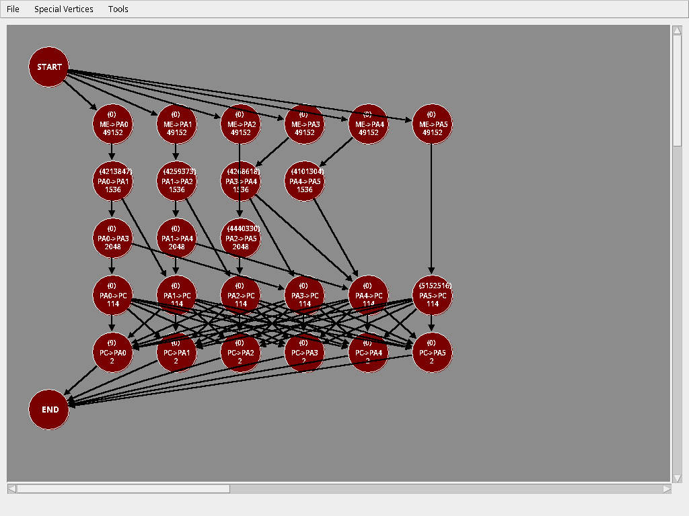

##### 3.5.7.1 Tempo de execução e caminho crítico

**Tools → Computation and Communication Analisys** destaca os caminhos críticos
(azul: comunicação; amarelo: computação e comunicação):

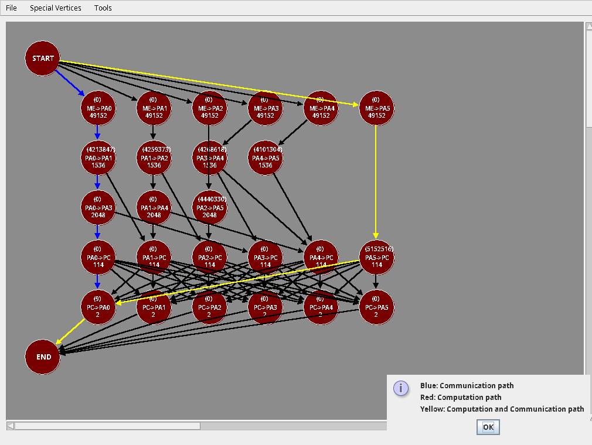

O caminho crítico passa pelo **PA5**, que é o último a receber o seu segmento
(as cargas saem em fila pela porta da memória, o ME) e também o que mais computa:
`ME→PA5 → PA5→PC (5 152 516 ciclos) → PC→PA0`.

O tempo foi medido no mapeamento natural (**Tools → Compute Mapping** e, na
janela de resultado, **Tools → Execution Time**;
[`saidas/cdcm_natural.timing`](saidas/cdcm_natural.timing)):

| Etapa | Ciclos |
|---|---|
| carga do segmento do PA5 | 0 a 294 934 (2,95 ms) |
| computação do PA5 | 5 152 516 (51,5 ms) |
| envio ao PC e resultado | cerca de 730 |
| **Tempo total** | **5 448 183 ciclos (54,5 ms)** |

A **computação é 95% do tempo**. Os seis PAs computam em paralelo, e o tempo
total é ditado pelo último a terminar. A carga dos segmentos, que no ACPM (modelo do padrão de comunicação) era
quase todo o tempo (2,99 ms), aqui é uma parcela pequena.

O CDCM foi explorado só no mapeamento natural. O ACPM mostrou que o tempo
praticamente não depende do mapeamento, e os algoritmos de busca do CDCM são
lentos, porque cada mapeamento testado simula todas as dependências.

##### 3.5.7.2 Consumo de energia

| Mapeamento | Energia dinâmica | Energia ociosa |
|---|---|---|
| natural | 6990,75 µJ | 4576,47 µJ |


A energia dinâmica é a mesma do ACPM no mesmo mapeamento (6990,75 µJ). A
energia ociosa é muito maior, porque o tempo de execução é maior:
84 mW × 54,5 ms = **4576 µJ**, ou 40% da energia total.

#### 3.5.8 Comparação entre os modelos

Exemplo 2 × 3:

| | CWM | ACPM | CDCM |
|---|---|---|---|
| O que captura (metamodelo QOD: Quantidade, Ordem e Dependência, aula 5) | quantidade de comunicação | quantidade e **ordem** da comunicação | quantidade e **dependência** da comunicação + quantidade de **computação** |
| Energia dinâmica, melhor mapeamento | 5079,97 µJ | 5079,97 µJ | — |
| Energia dinâmica, mapeamento natural | — | 6990,75 µJ | 6990,75 µJ |
| Energia ociosa, mapeamento natural | — | 251,38 µJ | 4576,47 µJ |
| Tempo de execução | — | 2,99 ms (só comunicação) | 54,5 ms (comunicação e computação) |
| O que revela | onde pôr cada núcleo para gastar menos energia | a fila na porta do ME (contenção) | o peso da computação e o PA que determina o fim |

Cada modelo acrescenta uma informação que o anterior não tinha, como prevê a
comparação qualitativa da aula 5. O CWM (modelo de comunicação com pesos) e o ACPM (modelo do padrão de comunicação) concordam no melhor
mapeamento, com o ME (memória) numa posição central da malha.

---

### 3.6 Atividade 5 — Número de processadores × desempenho × energia

#### 3.6.1 Segmentações e arquiteturas alvo

As três segmentações dividem **a mesma imagem oficial**: a tarefa é a mesma, e
só muda o número de processadores que a dividem. Em todas, a NoC (rede
intrachip) tem o bloco de PAs (processadores de segmento) na disposição dos
segmentos, mais uma coluna para o ME (memória) e o PC (processador coletor),
como descrito na seção 3.5.3.

| Segmentação | Segmento | PAs | Núcleos | NoC (tiles) | Objetos | Soma ingênua |
|---|---|---|---|---|---|---|
| 2 × 3 | 768 × 1024 | 6 | 8 | 2 × 4 = 8 | 13 | 18 |
| 4 × 6 | 384 × 512 | 24 | 26 | 4 × 7 = 28 | 13 | 27 |
| 8 × 6 | 192 × 512 | 48 | 50 | 8 × 7 = 56 | 13 | 41 |

Os traços e os modelos foram gerados como no passo 3.5.2, a partir de
[`imagem_trabalho_4x6.json`](imagem_trabalho_4x6.json) e
[`imagem_trabalho_8x6.json`](imagem_trabalho_8x6.json)
(saídas em [`saidas/09`](saidas/09_rosmi_par_trace_4x6.txt) a
[`saidas/12`](saidas/12_gen_cafes_8x6.txt)).

#### 3.6.2 Resultados no CAFES

**Mapeamento natural** nos modelos ACPM (modelo do padrão de comunicação) e CDCM
(modelo de dependência e computação), o mesmo mapeamento nos dois:

| Segmentação | Núcleos | Energia dinâmica | Energia ociosa (CDCM) | Energia total (CDCM) | Tempo de comunicação (ACPM) | Tempo total (CDCM) |
|---|---|---|---|---|---|---|
| 2 × 3 | 8 | 6990,75 µJ | 4576,47 µJ | 11 567,22 µJ | 2,99 ms | **54,5 ms** |
| 4 × 6 | 26 | 11 203,63 µJ | 6243,01 µJ | 17 446,64 µJ | 3,02 ms | **21,2 ms** |
| 8 × 6 | 50 | 13 521,02 µJ | 6113,17 µJ | 19 634,19 µJ | 3,06 ms | **10,4 ms** |

**Melhor mapeamento encontrado pelo Simulated Annealing**, energia dinâmica:

| Segmentação | CWM | ACPM | Natural | Redução |
|---|---|---|---|---|
| 2 × 3 | 5079,97 µJ | 5080,07 µJ | 6990,75 µJ | 27% |
| 4 × 6 | 7550,72 µJ | 7697,44 µJ | 11 203,63 µJ | 31 a 33% |
| 8 × 6 | 9771,59 µJ | 10 404,24 µJ | 13 521,02 µJ | 23 a 28% |

Resultado do 8 × 6 no CDCM (mapeamento natural) e no ACPM (Simulated
Annealing):

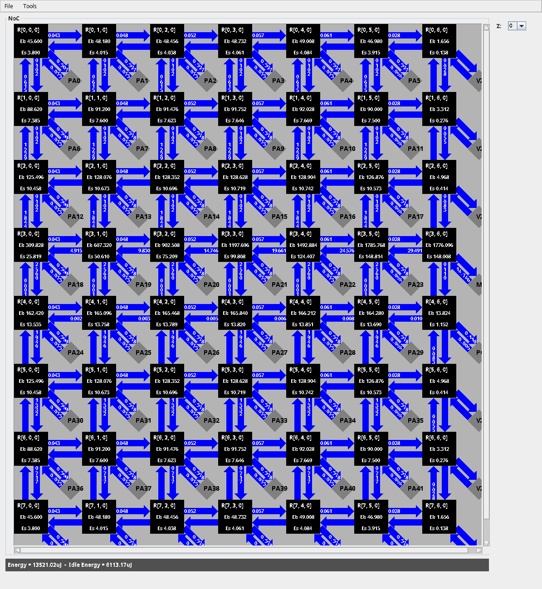

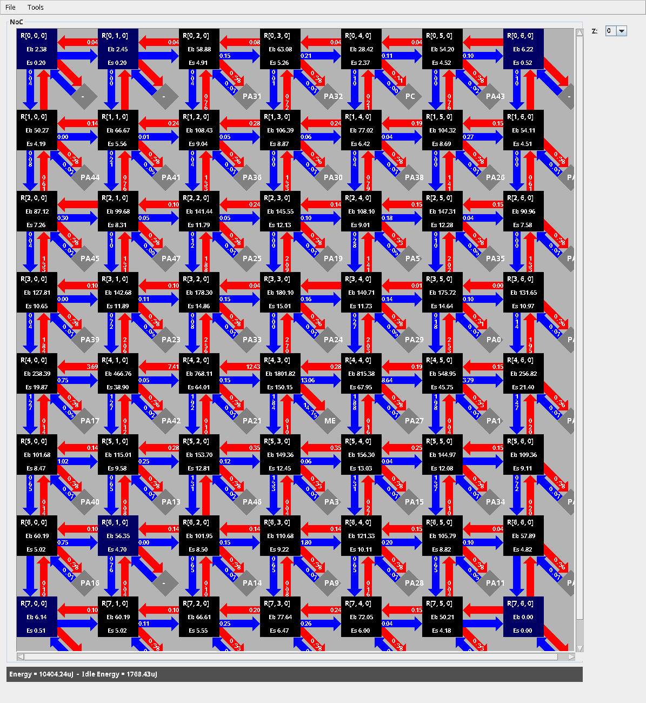

#### 3.6.3 Análise

- **Mais processadores reduzem o tempo**: 54,5 → 21,2 → 10,4 ms. O ganho é de
  2,6 vezes com 4 vezes mais processadores, e de 5,2 vezes com 8 vezes mais.
- **O ganho não é proporcional** porque duas partes não diminuem: a carga dos
  segmentos, que sai em fila pela única porta do ME, a memória (cerca de 3 ms em todas as
  segmentações, pelo modelo ACPM), e o PA (processador de segmento) mais lento, que dita o fim.
- **A energia sobe com o número de processadores.** A energia dinâmica passa de
  6991 para 13 521 µJ, porque há mais bordas para trocar (a soma ingênua vai de
  18 para 41) e as mensagens percorrem mais roteadores. A energia ociosa sobe de
  4576 para 6243 µJ no 4 × 6 e fica em 6113 µJ no 8 × 6: há mais roteadores
  (8, 28 e 56), mas o tempo de execução cai.
- **É um compromisso entre tempo e energia:**

  | Segmentação | Tempo total | Energia total |
  |---|---|---|
  | 2 × 3 | 54,5 ms | 11 567 µJ |
  | 4 × 6 | 21,2 ms (2,6× mais rápido) | 17 447 µJ (1,5× mais energia) |
  | 8 × 6 | 10,4 ms (5,2× mais rápido) | 19 634 µJ (1,7× mais energia) |

  A melhor escolha depende do requisito: menor energia, 2 × 3; menor tempo,
  8 × 6.
- **O mapeamento importa em todas as segmentações**: o melhor mapeamento
  encontrado gasta de 23 a 33% menos energia dinâmica que o natural, porque
  aproxima o ME (memória) de todos os PAs.

---

## 4. Resumo dos resultados

| Etapa | Resultado |
|---|---|
| `rosmi_seq --conn 8` | **13** (soma ingênua 18) |
| `rosmi_par --conn 8`, 1/2/4/8 threads | **13** em todas |
| `rosmi_par --conn 4` | 473 |
| 2 × 3, melhor mapeamento (CWM e ACPM) | **5079,97 µJ** |
| Sequencial, num tile de 100 MHz | 368 ms |
| 2 × 3, tempo (ACPM / CDCM) | 2,99 ms / 54,5 ms |
| 2 × 3 → 4 × 6 → 8 × 6, tempo total (CDCM) | 54,5 → 21,2 → 10,4 ms |
| 2 × 3 → 4 × 6 → 8 × 6, energia total (CDCM) | 11 567 → 17 447 → 19 634 µJ |

## 5. Conteúdo desta pasta

```
reports/
  README.md                este registro
  imagem_trabalho.png      imagem oficial do trabalho (entrada do ROSMI)
  imagem_trabalho.json     segmentação 2 × 3 (N, M, K, L), lida pelo gen_cafes.py
  imagem_trabalho_4x6.json segmentação 4 × 6
  imagem_trabalho_8x6.json segmentação 8 × 6
  saidas/                  saída de cada comando (.txt), traços (.csv),
                           tabelas de tempo do CAFES (.timing) e logs do CAFES
  cafes/                   modelos .CWG, .ACPG e .cdcg das três segmentações
  prints/                  imagens deste registro (prints/exploracao: CAFES)
```
